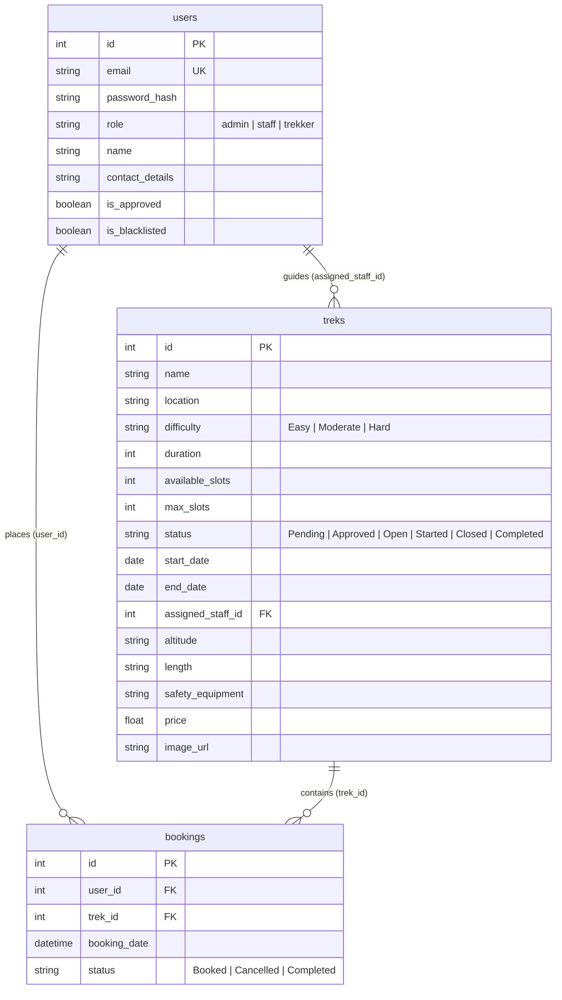

# Academic Project Report: Trekking Management Application

---

## 1. Student Details
- **Student Name**: [Your Name Here]
- **Roll Number / Student ID**: [Your ID Here]
- **Course**: Web Application Development (Flask)
- **Submission Date**: July 2026

---

## 2. Project Details & Approach

### Question Statement
Adventure organizations require efficient systems to manage trekking activities involving trek organizers (Admins), guides (Trek Staff), and participants (Trekkers). The goal is to build a role-based, database-backed web application using Flask, SQLite, and Bootstrap that:
1. Prevents overbooking beyond maximum capacities.
2. Implements secure role-based access control (Admin, Staff, Trekker).
3. Restricts guides to managing only their assigned treks.
4. Allows trekkers to search, filter, and book treks with a full history log.
5. Employs robust input validation and clean, modern user interfaces.

### Approach to the Problem
We implemented a modular Flask architecture split into functional components:
- **Extensions & Config**: Integrated shared instances (`db`, `login_manager`) in `app/extensions.py` to eliminate circular import issues.
- **Role-based Authentication**: Built a custom `@role_required` decorator in `app/decorators.py` that intercepts unauthorized accesses and redirects users based on approval or blacklisting statuses.
- **Relational Schema Design**: Programmed three main entities (`User`, `Trek`, `Booking`) with strict Foreign Key references and atomic count decrements to prevent race conditions during booking.
- **Responsive Interface**: Developed clean, responsive layouts using Bootstrap and custom CSS tokens (`static/css/custom.css`), including a glassmorphic navigation bar and frosted-glass portal inputs.
- **RESTful Integration**: Exposed lightweight JSON endpoints under `/api` for decoupled data fetching.

---

## 3. AI/LLM Declaration
This project was developed with assistance from Google Antigravity (Advanced Agentic Coding AI). The AI agent assisted with:
- Scaffold generation of the blueprint layout models.
- Relocation of tables and modals to resolve rendering backdrop glitches.
- Implementation of Chart.js metrics widgets.
- Integration of validation patterns for Indian locale formats (`+91` contact details check).

---

## 4. Frameworks & Libraries Used
- **Backend Framework**: Flask (Python)
- **Database Wrapper**: Flask-SQLAlchemy (SQLAlchemy Core)
- **Session Authentication**: Flask-Login
- **Frontend Engine**: Jinja2 Templating
- **UI Toolkit**: Bootstrap 5
- **Visual Charts**: Chart.js (via static CDN)

---

## 5. Entity-Relationship Diagram (ERD)

---

## 6. API Resource Endpoints

| Endpoint | Method | Description | Response Format |
|---|---|---|---|
| `/api/treks` | `GET` | Retrieve all registered treks and their specifications. | JSON Array |
| `/api/treks/<id>` | `GET` | Retrieve detailed metrics of a specific trek route. | JSON Object |
| `/api/bookings` | `GET` | Retrieve the global list of reservation logs. | JSON Array |
| `/api/users` | `GET` | Retrieve all user/staff profiles (excluding passwords). | JSON Array |

---

## 7. Presentation Video Link
- **Google Drive Link**: [Insert Your Shared Google Drive Video Link Here]
- **Video Duration**: [e.g., 6 Minutes]
